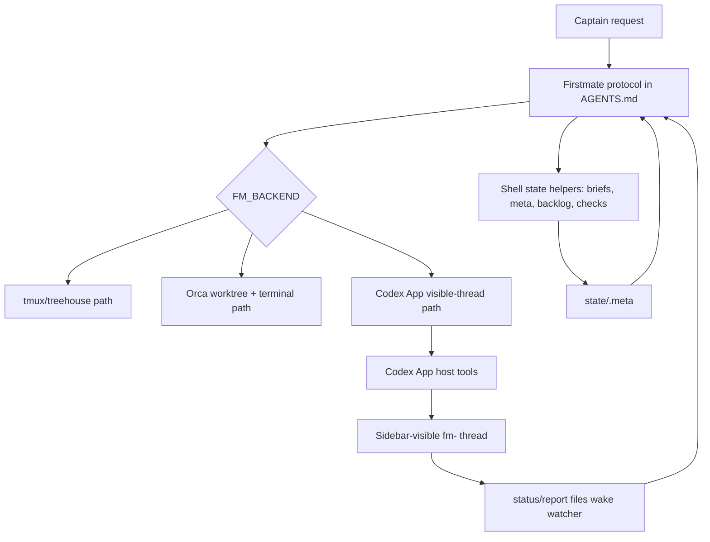
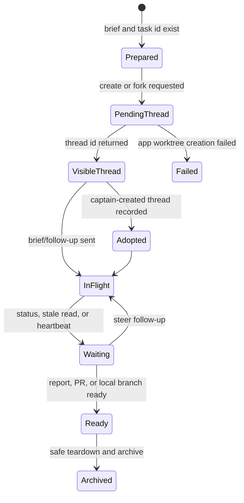
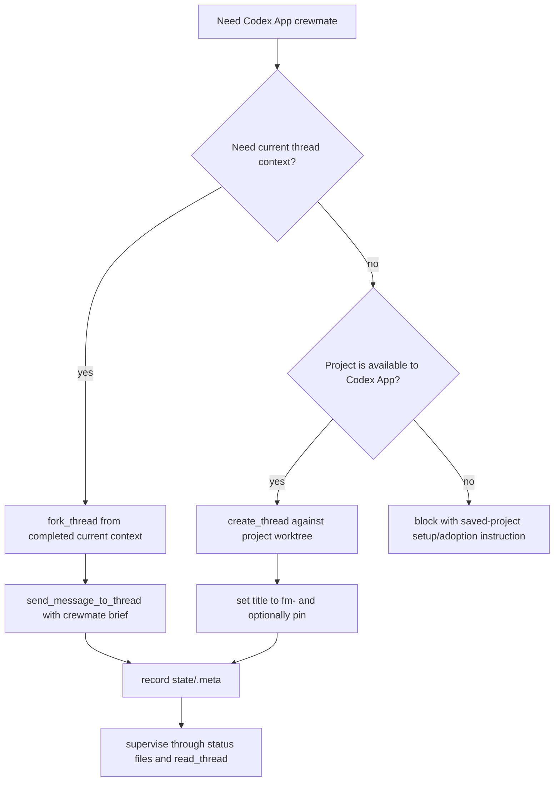

# feat: Rework Codex App backend for visible threads

## Summary

Rework Firstmate's Codex App backend so `FM_BACKEND=codex-app` creates and supervises real Codex Desktop threads visible in the sidebar.
Keep tmux and Orca behavior unchanged, and ensure the former `codex app-server` path cannot pass as a visible backend.

---

## Problem Frame

Firstmate promises a visible crew: every crewmate should live somewhere the captain can watch, interrupt, and type into.
The earlier Codex App branch used `codex app-server --stdio --enable remote_control` through `bin/fm-codex-app`.
Live smoke tests showed that path can complete turns, but its threads do not reliably materialize in Codex Desktop's visible, persisted thread list.

That is the wrong contract for this backend.
`FM_BACKEND=codex-app` should map to the same app-owned primitives Codex Desktop uses for ordinary thread creation, fork, send, handoff, title, pin, read, and archive.
Shell scripts can maintain Firstmate state, but they cannot pretend to be the Codex App host.

---

## Requirements

**Visible Thread Contract**

- R1. `FM_BACKEND=codex-app` starts a Codex Desktop thread that is visible in the sidebar with the `fm-<id>` handle.
- R2. A spawned Codex App crewmate receives the same brief contract as tmux and Orca crewmates, including status-file reporting and delivery-mode rules.
- R3. Firstmate records enough Codex App metadata to reconcile after restart, including `thread_id`, task kind, project, mode, yolo posture, and any pending worktree handle.
- R4. A completed or active Codex App task can be read and steered through Codex App thread tools, not through the headless app-server transport.

**Handoff and Context**

- R5. Firstmate supports the normal Codex App handoff shape: fork a completed context when the captain wants a new thread to inherit context, send a follow-up prompt to continue work, and hand off existing visible threads when the captain asks to move them.
- R6. Project task spawn and current-thread context fork are separate flows, because forking the Firstmate thread is not the same as opening a project-scoped crewmate.
- R7. Firstmate can adopt an existing visible Codex App thread into `state/<id>.meta` when the captain has already spawned or intervened manually.

**Compatibility and Safety**

- R8. The tmux and Orca backends keep their current command paths, metadata fields, and teardown behavior.
- R9. The existing app-server implementation is not advertised as the visible Codex App backend unless a smoke test proves sidebar visibility, resume, read, steer, and archive.
- R10. Ship teardown for Codex App tasks refuses to discard unlanded work unless Firstmate can inspect the app-owned worktree or the captain explicitly approves discard.

**Verification**

- R11. The acceptance smoke for Codex App requires sidebar visibility, `list_threads` discoverability, `read_thread` access, `send_message_to_thread` steering, optional `handoff_thread`, archive, and restart reconciliation.
- R12. CI keeps enforcing shell syntax, ShellCheck, Node syntax for any retained Node helper, symlink invariants, and no tracked personal fleet paths.

---

## Key Technical Decisions

- KTD1. `codex-app` means visible app-owned threads.
  The captain asked for Codex App operation, and the existing smoke results showed app-server threads are headless in practice.
  A backend named `codex-app` that does not show visible threads is worse than no backend because it trains Firstmate to lose the captain's intervention surface.

- KTD2. Split shell-owned state from app-owned thread actions.
  Firstmate's shell scripts should continue to own briefs, local metadata, safety checks, and backend-neutral helpers.
  Codex App thread creation, fork, send, handoff, read, title, pin, and archive must be done through Codex App host tools while running inside Codex Desktop.

- KTD3. Treat app-server as headless until proven otherwise.
  The previous `bin/fm-codex-app` helper spoke app-server JSON-RPC directly.
  If a non-visible app-server helper returns later, name it separately so it never satisfies visible backend acceptance criteria.
  Do not let it satisfy the visible backend acceptance criteria.

- KTD4. Add an adoption path for existing visible threads.
  The captain can spawn, fork, or type into Codex App threads directly.
  Firstmate should reconcile that reality by recording a visible thread as a managed task instead of insisting every task originate from `fm-spawn.sh`.

- KTD5. Preserve backend independence.
  The Orca backend already works through Orca worktree and terminal handles.
  The Codex App pivot should branch only where host-tool mediation is required, leaving tmux and Orca code paths covered by regression checks.

---

## High-Level Technical Design

### Backend Responsibility Split

### Codex App Spawn and Adoption Lifecycle

### Spawn Flow Choice

---

## Scope Boundaries

### In Scope

- Rework Firstmate's Codex App backend contract around visible Codex Desktop threads.
- Update AGENTS.md and README.md so they stop implying the app-server path is a visible Codex App backend.
- Add helper support for recording, adopting, reconciling, and tearing down app-owned thread metadata.
- Add tests and smoke criteria that protect tmux, Orca, and the new Codex App path.

### Deferred to Follow-Up Work

- Fully automated shell-only Codex App thread creation.
  That requires an app-exposed CLI or bridge that can invoke host thread tools outside the model tool surface.
- Mixed-harness Codex App fleets.
  The Codex App backend should run Codex threads only; tmux and Orca remain the mixed-harness paths.
- Cloud handoff support beyond the local host and already connected Codex App hosts.

### Out of Scope

- Changing the captain's upstream remote ownership.
  Work stays on the captain fork and local no-mistakes remote; upstream push remains disabled.
- Reworking Firstmate's delivery modes.
  `no-mistakes`, `direct-PR`, and `local-only` behavior stay as they are.

---

## System-Wide Impact

This change affects Firstmate's core supervision model, not just one helper script.
The watcher remains shell-based, but Codex App visibility and thread status become app-owned state that Firstmate must read through host tools.
That weakens any assumption that every backend operation can be expressed as one shell command.

The biggest operational consequence is restart recovery.
For tmux and Orca, `state/<id>.meta` names a terminal-like handle Firstmate can inspect from shell.
For Codex App, `state/<id>.meta` names a thread handle that only Codex Desktop can read.
AGENTS.md must make that distinction impossible to miss.

---

## Implementation Units

### U1. Reclassify the Previous App-Server Path

- **Goal:** Prevent the previous app-server helper from being mistaken for the visible Codex App backend.
- **Requirements:** R1, R4, R9, R11.
- **Dependencies:** None.
- **Files:** `bin/fm-codex-app`, `bin/fm-spawn.sh`, `bin/fm-backend.sh`, `bin/fm-watch.sh`, `README.md`, `AGENTS.md`, `test/fm-codex-app-headless.test.sh`.
- **Approach:** Demote the app-server transport so `FM_BACKEND=codex-app` no longer defaults to a path that live smoke proved headless.
  Keep the dependency-free Node helper as a visible-thread ledger and make the name and docs honest.
- **Patterns to follow:** Existing backend switch structure in `bin/fm-backend.sh`; dependency-light helper style in `bin/fm-codex-app`; documentation wording in `README.md`.
- **Test scenarios:**
  - With the visible backend selected and no shell host-tool bridge available, spawn stops at preparation with a clear visible-thread action instead of silently using app-server.
  - The helper syntax-checks as a ledger and contains no app-server transport path.
  - Documentation no longer describes app-server completion as a successful visible backend smoke.
- **Verification:** A reader cannot confuse headless app-server completion with a visible Codex App thread, and existing Node syntax checks still pass for any retained helper.

### U2. Add Codex App Visible Thread State Helpers

- **Goal:** Give Firstmate a local state contract for app-owned visible threads without pretending shell owns the app thread.
- **Requirements:** R1, R3, R4, R7, R10.
- **Dependencies:** U1.
- **Files:** `bin/fm-codex-app`, `bin/fm-spawn.sh`, `bin/fm-teardown.sh`, `bin/fm-peek.sh`, `bin/fm-send.sh`, `test/fm-codex-app-state.test.sh`.
- **Approach:** Refactor the helper around local state operations: prepare spawn metadata, record returned `thread_id` or pending worktree handle, adopt an existing thread, mark archive intent, and expose actionable errors when a shell command needs an app host tool.
  The shell helper should be a ledger and validator, not the thread transport.
- **Patterns to follow:** `state/<id>.meta` field style from `fm-spawn.sh`; backend selector helpers in `fm-backend.sh`; teardown refusal language in `fm-teardown.sh`.
- **Test scenarios:**
  - Recording a visible thread writes backend, window, project, harness, kind, mode, yolo, and thread id without disturbing Orca-specific fields.
  - Adoption refuses duplicate task ids and duplicate thread ids.
  - A pending worktree record survives restart reconciliation and is distinguishable from a completed visible thread record.
  - Shell send/peek commands for visible Codex App threads fail with host-tool instructions when no app bridge result is provided.
- **Verification:** Firstmate can reconstruct task identity from meta alone, and shell-only attempts cannot accidentally talk to app-server.

### U3. Teach AGENTS.md the Host-Tool Codex App Protocol

- **Goal:** Make Codex App mode executable by a Firstmate agent running inside Codex Desktop.
- **Requirements:** R1, R2, R4, R5, R6, R7, R11.
- **Dependencies:** U2.
- **Files:** `AGENTS.md`, `README.md`, `test/fm-doc-codex-app-protocol.test.sh`.
- **Approach:** Add a Codex App backend subsection that says when to use `create_thread`, `fork_thread`, `send_message_to_thread`, `handoff_thread`, `read_thread`, `list_threads`, `set_thread_title`, `set_thread_pinned`, and `set_thread_archived`.
  The protocol should distinguish project task spawn from current-thread handoff, because they preserve different context.
- **Patterns to follow:** Existing adapter verification tables in AGENTS.md; backend lifecycle prose in AGENTS.md section 7; "visible crew" language in README.md.
- **Test scenarios:**
  - The docs state that Codex App host tools are required for visible mode and that shell app-server is not equivalent.
  - Project spawn instructions use project-scoped thread creation rather than forking the Firstmate repo by habit.
  - Current-thread context handoff instructions use fork/send semantics and warn that only completed history is copied.
  - Existing Orca instructions remain present and unchanged in meaning.
- **Verification:** A fresh Codex App Firstmate session can follow AGENTS.md to spawn, steer, adopt, and archive a visible thread without reading prior chat.

### U4. Update Spawn, Send, Peek, Watch, and Teardown Semantics

- **Goal:** Make backend-neutral commands safe around visible Codex App metadata while keeping tmux and Orca behavior intact.
- **Requirements:** R3, R4, R8, R10, R11.
- **Dependencies:** U2, U3.
- **Files:** `bin/fm-spawn.sh`, `bin/fm-backend.sh`, `bin/fm-send.sh`, `bin/fm-peek.sh`, `bin/fm-watch.sh`, `bin/fm-teardown.sh`, `test/fm-backend-regression.test.sh`, `test/fm-codex-app-state.test.sh`, `test/fm-codex-app-teardown.test.sh`.
- **Approach:** Keep tmux and Orca command execution as-is.
  For visible Codex App records, shell commands either update local state from an app-tool result or print a precise host-tool action requirement.
  Teardown must archive the visible thread through Codex App only after the worktree safety check is satisfied or the captain explicitly approves discard.
- **Patterns to follow:** Existing backend case statements; refusal-first safety posture in `fm-teardown.sh`; watcher signal coalescing in `fm-watch.sh`.
- **Test scenarios:**
  - tmux backend selection and fallback behavior are unchanged.
  - Orca metadata, terminal send, peek, and teardown branches still parse and route exactly as before.
  - Codex App meta with a visible thread id is selectable by `fm-<id>` and by raw thread id.
  - Codex App teardown refuses ship work when worktree safety cannot be proven.
  - Scout teardown allows archive only after `data/<id>/report.md` exists.
- **Verification:** ShellCheck passes, backend regression tests pass, and Codex App visible records never fall back to tmux or app-server by accident.

### U5. Add Visible-Thread Smoke Contract

- **Goal:** Replace the weak "turn completed" smoke with acceptance criteria that prove the captain can operate through Codex Desktop.
- **Requirements:** R1, R4, R5, R7, R8, R11, R12.
- **Dependencies:** U3, U4.
- **Files:** `README.md`, `AGENTS.md`, `CONTRIBUTING.md`, `.github/workflows/ci.yml`, `test/fm-codex-app-smoke-contract.test.sh`.
- **Approach:** Document and automate what can be automated locally, then leave the live Desktop smoke as an explicit manual verification item when host tools are required.
  The smoke contract should require visibility, list/read discovery, steering, handoff or fork behavior, status-file wake, restart recovery, and archive.
- **Patterns to follow:** Development checks in README.md; empirical-verification rule for harness adapters in CONTRIBUTING.md; CI's dependency-light style.
- **Test scenarios:**
  - A fake visible-thread transcript that lacks `list_threads` discoverability fails the contract.
  - A fake transcript that completes a turn but cannot be read after runner exit fails the contract.
  - A fake transcript with create/read/send/archive evidence passes the non-interactive contract parser.
  - CI runs the new shell tests without tracking personal fleet paths.
- **Verification:** The same failure mode captured in local smoke reports cannot be reported as green again.

### U6. Run the Real Desktop Smoke Before PR Merge

- **Goal:** Prove the redesigned backend works on the actual Codex Desktop surface before the captain merges it.
- **Requirements:** R1, R2, R4, R5, R7, R8, R10, R11.
- **Dependencies:** U1, U2, U3, U4, U5.
- **Files:** `data/<smoke-id>/brief.md`, `data/<smoke-id>/report.md`, `state/<smoke-id>.meta`, `README.md`.
- **Approach:** Use a throwaway scout task in Codex App mode.
  Verify the thread appears in the sidebar as `fm-<id>`, can be found through `list_threads`, can be read through `read_thread`, accepts a follow-up through `send_message_to_thread`, and can be archived after the report exists.
  Then run an Orca regression smoke or equivalent command-path check to confirm that backend still works.
- **Patterns to follow:** Existing scout task contract in `bin/fm-brief.sh`; local smoke report style under `data/codex-app-live-smoke-*/report.md`.
- **Test scenarios:**
  - The Codex App scout writes `data/<id>/report.md` and `state/<id>.status`.
  - The thread remains visible and readable after the first turn completes.
  - A follow-up message reaches the same visible thread.
  - Teardown archives the thread and removes local state only after safety checks pass.
  - Orca backend smoke still creates a worktree and terminal handle or reports a precise environment blocker.
- **Verification:** The PR body includes the visible-thread smoke result, the Orca preservation result, and any remaining manual caveats.

---

## Acceptance Examples

- AE1. Given `FM_BACKEND=codex-app` and a saved Codex App project, when Firstmate spawns `fm-demo`, then the captain sees an `fm-demo` thread in Codex Desktop and Firstmate records its thread id.
- AE2. Given a visible Codex App crewmate has finished its first turn, when Firstmate sends a follow-up, then the same thread receives the prompt and the new turn is readable.
- AE3. Given a headless app-server turn completes but never appears in `list_threads`, when the smoke contract is evaluated, then the backend is rejected as not visible.
- AE4. Given Orca remains selected, when Firstmate spawns a task, then it still uses Orca worktree and terminal handles rather than any Codex App path.
- AE5. Given a Codex App ship task has unpushed or unmerged work, when teardown runs, then Firstmate refuses unless the captain explicitly approves discard.

---

## Risks & Dependencies

- **Host-tool availability:** Codex App visible mode depends on app tools that are available to Codex Desktop agents, not ordinary shell scripts.
  If those tools are unavailable, the backend must block with a clear message rather than falling back to app-server.
- **Worktree path discoverability:** Teardown safety depends on knowing where the app-owned worktree lives or proving that work has landed elsewhere.
  Ship tasks should remain blocked until the implementation can prove that safety path.
- **Watcher limitations:** The shell watcher cannot poll Codex App host tools by itself.
  Codex App crewmates must write status files, and Firstmate must use `read_thread` during status, stale, and heartbeat handling.
- **PR confusion:** At planning time, the captain fork had an open PR for the headless implementation.
  That PR should be revised or replaced before merge; merging it as-is would codify the wrong backend contract.

---

## Open Questions

- OQ1. Does the current Codex App thread read/list surface expose the app-owned worktree path reliably enough for ship-task teardown safety?
  If not, visible Codex App mode should start with scout/adoption support and keep ship teardown blocked until a safe path exists.
- OQ2. Is there an installable Codex App bridge that lets Firstmate scripts invoke host thread tools directly?
  Without that bridge, Codex App visible mode is an in-app Firstmate protocol plus shell state helpers, not a pure shell backend.

---

## Documentation / Operational Notes

- README.md should say `codex-app` requires running Firstmate inside Codex Desktop because visible thread operations are app-owned.
- AGENTS.md should make `create_thread` versus `fork_thread` a first-class decision.
  Project work should use project-scoped creation; current-context handoff should use fork/send.
- CONTRIBUTING.md should require empirical Codex Desktop smoke evidence for any future changes to the Codex App backend, the same way harness adapters require live verification.

---

## Sources & Research

- The previous `bin/fm-codex-app` path started `codex app-server --stdio --enable remote_control` and called thread JSON-RPC directly.
- The previous `bin/fm-spawn.sh` path mapped `FM_BACKEND=codex-app` to a local git worktree plus the app-server helper.
- `bin/fm-backend.sh`, `bin/fm-send.sh`, `bin/fm-peek.sh`, `bin/fm-watch.sh`, and `bin/fm-teardown.sh` now preserve tmux and Orca behavior through backend switch points.
- `README.md` and `AGENTS.md` now describe Codex App mode as a visible-thread protocol rather than app-server completion.
- Local smoke reports under `data/codex-app-live-smoke-*/report.md` show completed or interrupted app-server turns that were not visible or persisted in Codex Desktop thread discovery.
- Codex Desktop currently exposes visible-thread host tools for project thread creation, thread fork, follow-up send, handoff, read, list, title, pin, and archive.
- At planning time, the captain fork PR for the headless implementation was open at `https://github.com/SSBrouhard/firstmate/pull/1`; upstream push remained disabled.
